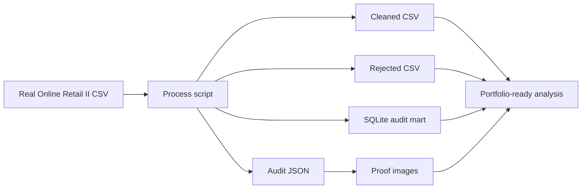

# Architecture

## Design choices

- Keep the pipeline script-first so it is reproducible without notebooks.
- Store rejected rows instead of discarding them so the audit trail is visible.
- Generate proof images directly from the computed summary so the visuals cannot drift away from the numbers.
- Keep the bundled SQLite file compact and reviewable rather than shipping a giant binary artifact.
